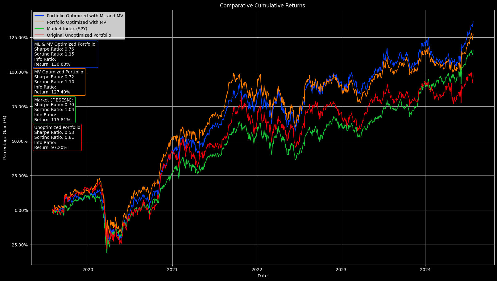

# Stock Portfolio Machine Learning Optimization

## Project Overview
This project focuses on optimizing stock portfolios using various financial theories and machine learning models. It includes modules for factor analysis, mean-variance optimization, machine learning strategies for stock prediction, the Black-Litterman model for adjusting portfolio weights based on machine learning predictions, and portfolio statistics calculations.

## Features
- **Mean-Variance Optimization**: Calculates the optimal asset allocation by balancing expected return against risk, subject to constraints on individual asset weights.
- **Machine Learning Strategies**: Employs various machine learning algorithms to forecast stock returns. It enhances the decision-making process by providing predictive insights based on historical data.
- **Black-Litterman Model**: Integrates market equilibrium and machine learning predictions to adjust expected returns. This model refines the portfolio optimization process by incorporating predictions into objective market data.
- **Portfolio Statistics**: Provides essential metrics such as the Sharpe Ratio, Sortino Ratio, and Information Ratio to evaluate the performance and risk-adjusted returns of investment portfolios.
- **Factor Analysis** (WIP): Examines how Fama-French factors like market risk, size, and value impact portfolio returns. This analysis is beneficial in understanding the driving forces behind portfolio performance.

## Libraries
- `pandas`: Essential for data manipulation and transformation. It is used to handle dataframes, perform data cleaning, and prepare datasets for analysis and visualization.
- `yfinance`: Primary source for downloading stock and market data. It is used across various modules to fetch historical stock prices and other financial data for analysis.
- `numpy`: Utilized for array and numerical computations. It is particularly used in the mean-variance optimization process for handling arrays and performing mathematical operations.
- `matplotlib` and `seaborn`: Both crucial for data visualization. While matplotlib is used for plotting graphs and charts, seaborn enhances these visualizations with more attractive and informative statistical graphics.
- `sklearn` (scikit-learn): Deployed for implementing and training machine learning models, such as Linear Regression, Random Forest, and Gradient Boosting, in the machine learning strategies module. It is also used for splitting data into training and test sets and evaluating model performance.
- `statsmodels`: Utilized for conducting statistical tests and models, particularly in factor analysis. It is used for running regression analyses to assess the impact of different financial factors on stock returns.


`

## Sample Output
Below is an example of the output produced by running the code with sample input parameters. The table shows the allocation percentages for each stock in the original Mean-Variance Optimization, as well as the Machine Learning-enhanced Mean-Variance Optimization. The Chart shows the performance of the three portfolios against the market representation (BSESENSEX) and provices metrics for each portfolio's performance.

```plaintext
              Original MV Optimization ML MV Optimization
RELIANCE.NS     15.79%          23.16%             40.38%
TCS.NS          12.63%          14.55%             15.96%
HDFCBANK.NS     13.68%          10.96%              3.81%
INFY.NS         10.53%           1.70%              2.73%
HINDUNILVR.NS    8.42%           6.89%             10.16%
ITC.NS           7.37%           5.16%             12.92%
KOTAKBANK.NS     6.32%           7.26%              6.16%
ICICIBANK.NS     8.42%           1.96%              3.09%
BAJFINANCE.NS    9.47%           3.61%              3.12%
LT.NS            7.37%          24.75%              1.68%
```

 

